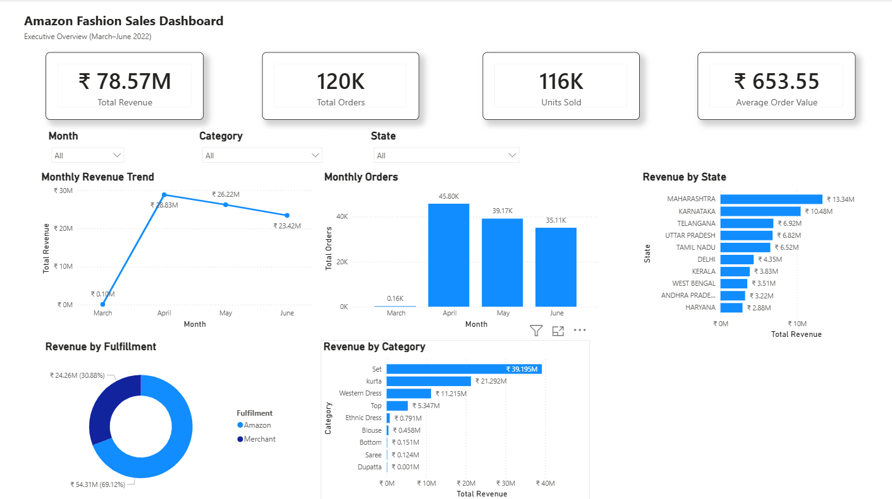
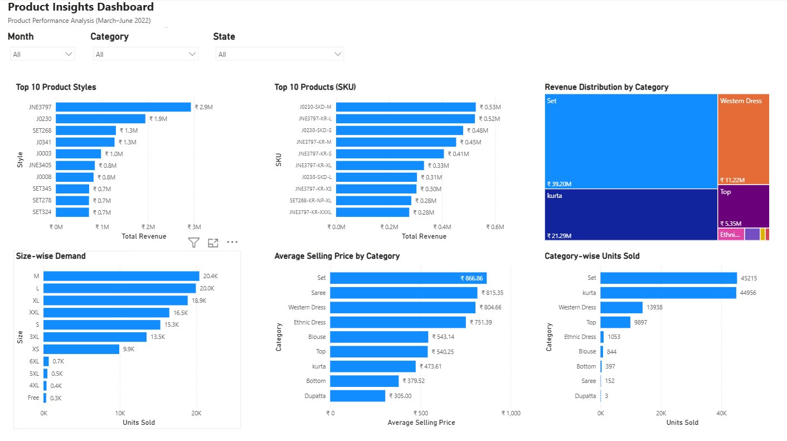
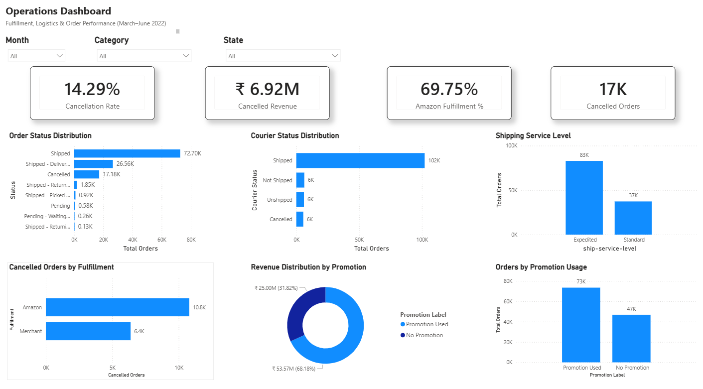

# 📊 Amazon Fashion Sales Analysis



A comprehensive end-to-end **Data Analytics** project that analyzes Amazon Fashion sales data using **Python, MySQL, and Power BI**.

## ⭐ Project Highlights
- Cleaned and analyzed **128,713** Amazon Fashion sales records.
- Performed business analysis using **MySQL**.
- Developed **30+ SQL queries**.
- Built **3 interactive Power BI dashboards**.
- Created DAX measures for KPIs.

## 📌 Project Overview
This project analyzes Amazon Fashion sales data (March–June 2022) covering:
- Sales Performance
- Product Analysis
- Geographic Analysis
- Fulfilment Analysis
- Promotion Analysis

## 🎯 Problem Statement

Amazon Fashion processes thousands of customer orders across multiple product categories, regions, fulfillment methods, and promotional campaigns. While this transactional data contains valuable business information, it is difficult to identify meaningful trends and performance indicators without proper analysis.

The objective of this project is to transform raw sales data into actionable business insights by analyzing revenue trends, customer purchasing behavior, product performance, geographic distribution, fulfillment efficiency, and promotional effectiveness.

Using **Python** for data preprocessing, **MySQL** for business analysis, and **Power BI** for interactive dashboards, this project enables stakeholders to monitor key performance indicators (KPIs), evaluate business performance, and support data-driven decision-making.

## 🎯 Objectives
- Analyze business performance
- Identify top-performing products
- Evaluate fulfilment
- Measure promotion impact
- Build interactive dashboards

## 📂 Dataset
- Records: **128,713**
- Format: CSV

## 📋 Prerequisites
- Python 3.10+
- Jupyter Notebook/JupyterLab
- MySQL Server & Workbench
- Microsoft Power BI Desktop

## ⚙️ Installation
```bash
git clone https://github.com/samyak2305/Amazon-Fashion-Sales-Analysis.git
cd Amazon-Fashion-Sales-Analysis
pip install -r requirements.txt
```

Run `datasets/Data_Cleaning_Preprocessing.ipynb`, import the cleaned CSV into MySQL, execute the SQL scripts, then open `powerbi/Amazon_Fashion_Sales_Analysis.pbix`.

## 🛠️ Tools
- Python
- Pandas
- NumPy
- MySQL
- Power BI
- DAX
- Jupyter

## 🧹 Data Cleaning
- Removed duplicates
- Handled missing values
- Converted dates
- Standardized data types
- Created Year, Month, Quarter, Weekday and Promotion Used columns

## 🗄️ SQL Analysis
Modules:
- KPI Analysis
- Sales Analysis
- Product Analysis
- Geographic Analysis
- Fulfilment Analysis
- Promotion Analysis

## 💻 SQL Query Showcase

The following SQL queries demonstrate how business questions were answered using MySQL. These queries helped analyze sales performance, product contribution, and operational efficiency.

---

### 📈 Query 1: Monthly Revenue Trend

**Business Question:**  
**How did the company's revenue change from month to month?**

This query calculates the total revenue generated each month, helping identify sales trends and business performance over time.

```sql
SELECT
    Year,
    Month_Num,
    Month,
    ROUND(SUM(Amount),2) AS Revenue
FROM amazon_sales_data
GROUP BY Year, Month_Num, Month
ORDER BY Year, Month_Num;
```

---

### 📦 Query 2: Category Revenue Contribution

**Business Question:**  
**Which product categories contributed the most to the company's total revenue?**

This query calculates the revenue generated by each product category and its percentage contribution to the overall revenue.

```sql
SELECT
    Category,
    ROUND(SUM(Amount),2) AS Revenue,
    ROUND(
        SUM(Amount) * 100 /
        (SELECT SUM(Amount) FROM amazon_sales_data),
        2
    ) AS Revenue_Percentage
FROM amazon_sales_data
GROUP BY Category
ORDER BY Revenue DESC;
```

---

### 🚚 Query 3: Order Cancellation Rate

**Business Question:**  
**What percentage of customer orders were cancelled?**

This query calculates the overall cancellation rate to evaluate order fulfillment performance and identify operational challenges.

```sql
SELECT
    ROUND(
        COUNT(
            DISTINCT CASE
                WHEN Status = 'Cancelled'
                THEN `Order ID`
            END
        ) * 100 /
        COUNT(DISTINCT `Order ID`),
        2
    ) AS Cancellation_Rate
FROM amazon_sales_data;
```

---

> 📌 **Additional SQL scripts included in this project:**
>
> - KPI Analysis
> - Sales Analysis
> - Product Analysis
> - Geographic Analysis
> - Fulfilment Analysis
> - Promotion Analysis

## 📊 Dashboards

### Executive Dashboard


### Product Insights Dashboard


### Operations Dashboard


## 📌 Key Insights
- ₹78.57M revenue
- ~120K orders
- Set category generated the highest revenue
- Maharashtra was the top-performing state
- April recorded peak sales
- ~14.29% cancellation rate

## 📚 Skills Demonstrated
- Python
- SQL
- Power BI
- DAX
- Data Cleaning
- Business Intelligence
- Dashboard Design

## 🚀 Future Improvements
- Sales Forecasting
- Customer Segmentation
- Real-time Dashboards
- Inventory Analytics

## 👨‍💻 Author

**Samyak Gaikwad**

GitHub: https://github.com/samyak2305

LinkedIn: https://www.linkedin.com/in/samyak-gaikwad-30992236a/
